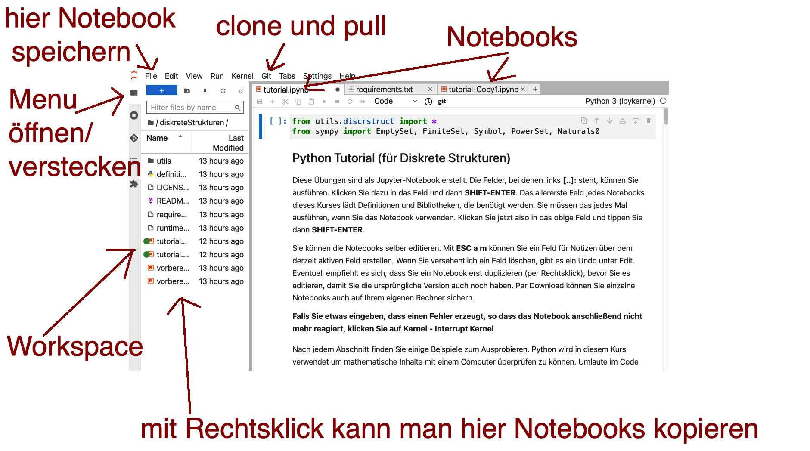

# Einloggen

Um die Notebooks zu verwenden, benötigen Sie die Jupyter-Software. Sie können diese über die Academic-Cloud verwenden (empfohlen) oder auch selber auf Ihrem eigenen Rechner installieren (nicht empfohlen). Die Academic-Cloud erreichen Sie folgendermaßen:

* Die URL https://jupyter-cloud.gwdg.de/ eingeben.
    
* Dann sollte sich die Academic-Cloud-Seite öffnen. Dort auf "Föderierte Anmeldung" klicken.
    
* "Ostfalia" auswählen und mit dem normalen Ostfalia-Passwort anmelden.

# Falls Sie noch keinen Ostfalia-Login haben:

Siehe weiter unten

# Mit Jupyter arbeiten

Nachdem das Jupyter-Lab vollständig geladen ist, erreichen Sie die Kursmaterialien folgendermaßen:

* Unter dem Reiter "Git" die Auswahl "Clone a Repository" wählen.
    
* Die URL https://github.com/upriss/vorkurs eingeben.
    
* Links auf "vorkurs" klicken, um den Workspace zu öffnen.
    
* Links auf 0_Einleitung.ipynb klicken, um das erste Notebook zu öffnen.

# Screenshot:

# Falls Sie noch keinen Ostfalia-Login haben:

Sie können die Notebooks auch über diesen Link starten. 

https://mybinder.org/v2/gh/upriss/vorkurs/master

Sie müssen aber etwas Geduld haben, bis das fertig geladen ist. Beim ersten Start kann es bis zu 10 Minuten dauern. Wenn Sie diese Umgebung mehrfach verwenden oder mehrere Leute die Umgebung verwenden, geht es deutlich schneller. Sie können in der Umgebung nichts speichern und müssen das Browser-Fenster im Vordergrund lassen. Außerdem müssen Sie das erste Mal, wenn Sie ein Feld ausführen, in dem 

from utils.vorkurs import *

das folgendermaßen ändern:

!pip install matplotlib
!pip install sympy
from utils.vorkurs import *